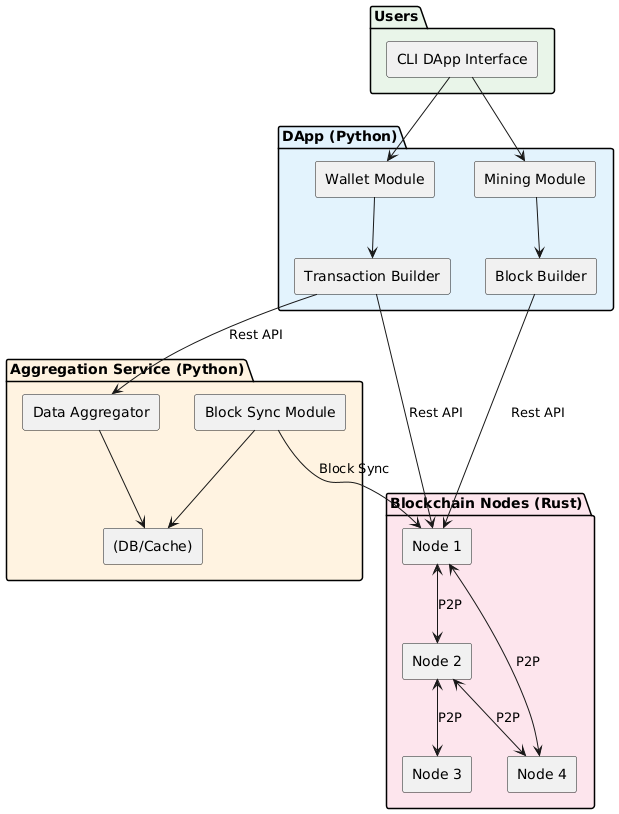
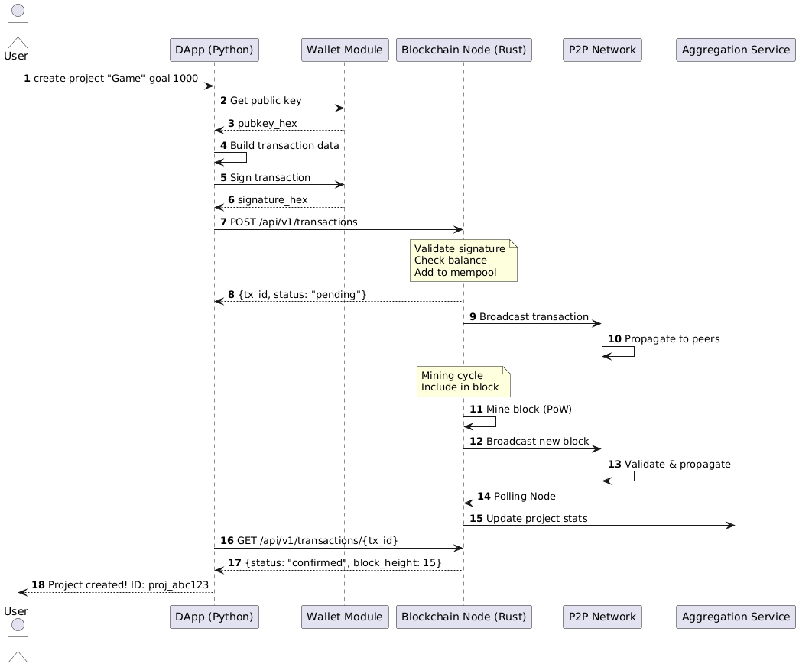
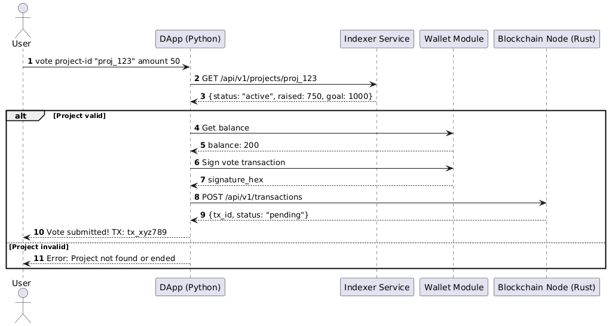
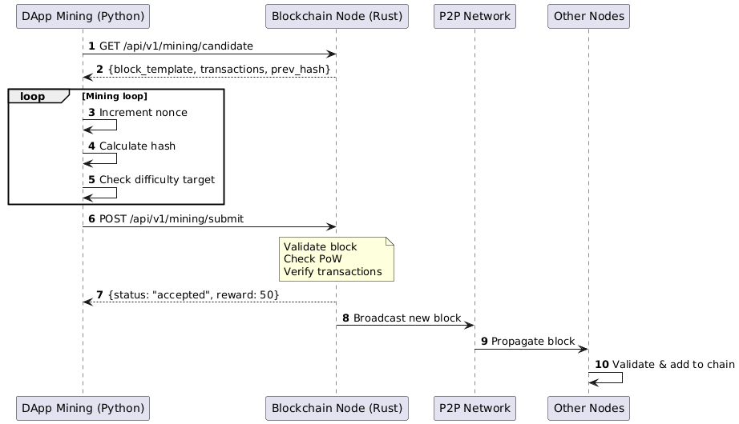

# BlockKick<рабочее название> - Децентрализованная краудфандинговая платформа на блокчейне

---

## О проекте

**BlockKick** - это децентрализованная краудфандинговая платформа (аналог Kickstarter), построенная на собственном блокчейне. Проект создан в образовательных целях.

### Ключевые особенности

- **Собственный блокчейн**
- **PoW консенсус**
- **P2P сеть между узлами**
- **Встроенный криптокошелёк**
- **Сервис для агрегации данных о проектах** 

---

##  Архитектура

### Общая архитектура системы



# Хуй знает может тут добавить расписанные технологии для каждого сервиса


---

## Компоненты системы

### 1. Core Protocol - Rust (потом добавим)

### 2. DApp + Wallet + Mining - Python (потом добавим)

### 3. Aggregation Service - Python (потом добавим)

---

## Сценарии использования

### 1. Создание проекта (Crowdfunding)



```bash
# Команда пользователя
create-project --name "Open Source Game" --goal 1000 --deadline 30

# Ответ системы
Project created! ID: proj_abc123
```

### 2. Голосование / Бэк проекта



```bash
# Команда пользователя
vote --project-id "proj_123" --amount 50

# Ответ системы
Vote submitted! TX: tx_def456
   Project raised: 800/1000 (80%) //тут сколько фантазии хватит
```

### 3. Майнинг блоков



```bash
# Запуск майнинга
start-mining --threads 4

# Вывод
Mining started...
    Block 105 found! Reward: 50 coins
    Broadcast to network...
```


---

# (ахуеете, потом пропишем)

### Требования для работы с проектом 

---

### Установка

---


## API Документация (и это потом....)

### Blockchain Node API


### Aggregation service API

---

## Формат транзакции

Все транзакции в BlockKick используют единый базовый формат с типизированными данными.

---

### Базовая Структура Транзакции

```json
{
  "id": "<tx_hash_sha256>",
  "tx_type": "<тип_транзакции>",
  "from": "<public_key_sender_hex>",
  "to": "<address_receiver_hex или null>",
  "data": { ... },
  "timestamp": <unix_timestamp>,
  "signature": "<ecdsa_signature_hex>",
  "fee": <> //на этот счет надо подумать, возможно и без этого заебемся
}
```

| Поле | Тип | Описание |
|------|-----|----------|
| `id` | String | SHA-256 хеш от сериализованной транзакции |
| `tx_type` | String | Тип транзакции: `create_project`, `fund_project`, `finalize_project`, `refund_project`, `transfer` | 
| `from` | String | Публичный ключ отправителя (hex, 64 символа) |
| `to` | String/null | Адрес получателя, `null` для операций с проектами |
| `data` | Object | Типо-специфичные данные транзакции (см. ниже) |
| `timestamp` | Integer | Unix timestamp создания транзакции |
| `signature` | String | ECDSA подпись транзакции (подписывается хеш всех полей кроме `signature`) |
| `fee` | Float | Комиссия за транзакцию |

---

### Типы Транзакций

---

#### 1. `create_project` - Создание проекта

Создает новый краудфандинговый проект в блокчейне. **Не переводит деньги.**

```json
{
  "id": "tx_a1b2c3d4e5f6...",
  "tx_type": "create_project",
  "from": "04a1b2c3d4e5f6...",
  "to": null,
  "data": {
    "project_id": "proj_x7y8z9...",
    "name": "Open Source Game",
    "description": "Indie game built with Rust",
    "goal_amount": 1000,
    "deadline_timestamp": 1735689600,
    "creator_wallet": "04creator_address_hex..."
  },
  "timestamp": 1733097600,
  "signature": "3045022100a1b2c3d4...",
  "fee": 0.001
}
```

| Поле в `data` | Тип | Описание |
|---------------|-----|----------|
| `project_id` | String | Уникальный ID проекта (SHA-256 от `name` + `creator_wallet` + `timestamp`) |
| `name` | String | Название проекта |
| `description` | String | Описание проекта |
| `goal_amount` | Integer | Целевая сумма сбора в коинах |
| `deadline_timestamp` | Integer | Unix timestamp дедлайна сбора |
| `creator_wallet` | String | Адрес кошелька создателя (куда придут деньги при успехе) |

---

#### 2. `fund_project` - Взнос в проект

Переводит средства от бэкера на **escrow-адрес проекта** (заморозка до завершения сбора).

```json
{
  "id": "tx_e5f6g7h8i9j0...",
  "tx_type": "fund_project",
  "from": "04backer_public_key_hex...",
  "to": "escrow_proj_x7y8z9...",
  "data": {
    "project_id": "proj_x7y8z9...",
    "amount": 50,
    "backer_note": "Good luck with the project!"
  },
  "timestamp": 1733098000,
  "signature": "3045022100b2c3d4e5...",
  "fee": 0.001
}
```

| Поле в `data` | Тип | Описание |
|---------------|-----|----------|
| `project_id` | String | ID проекта для финансирования |
| `amount` | Integer | Сумма взноса в коинах |
| `backer_note` | String | Опциональное сообщение от бэкера |


**Куда идут деньги:**
```
escrow_address = SHA256(project_id + "escrow")
```
Средства замораживаются на этом адресе до завершения проекта.

---

#### 3. `finalize_project` - Завершение сбора

Система инициирует завершение проекта после дедлайна. Определяет успех или провал.

```json
{
  "id": "tx_i9j0k1l2m3n4...",
  "tx_type": "finalize_project",
  "from": "04any_user_public_key...",
  "to": null,
  "data": {
    "project_id": "proj_x7y8z9...",
    "action": "claim"
  },
  "timestamp": 1735689700,
  "signature": "3045022100c3d4e5f6...",
  "fee": 0.001
}
```

| Поле в `data` | Тип | Описание |
|---------------|-----|----------|
| `project_id` | String | ID проекта для завершения |
| `action` | String | `claim` (забрать) или `refund` (вернуть) — вычисляется автоматически |

---

#### 4. `refund_project` - Возврат средств

Возвращает средства бэкеру если проект не достиг цели.

```json
{
  "id": "tx_m3n4o5p6q7r8...",
  "tx_type": "refund_project",
  "from": "04backer_public_key_hex...",
  "to": "04backer_public_key_hex...",
  "data": {
    "project_id": "proj_x7y8z9...",
    "original_tx_id": "tx_e5f6g7h8i9j0...",
    "refund_amount": 50
  },
  "timestamp": 1735690000,
  "signature": "3045022100d4e5f6g7...",
  "fee": 0.001
}
```

| Поле в `data` | Тип | Описание |
|---------------|-----|----------|
| `project_id` | String | ID проекта |
| `original_tx_id` | String | ID оригинальной транзакции `fund_project` |
| `refund_amount` | Integer | Сумма возврата (должна совпадать с оригинальным взносом) |

---

#### 5. `transfer` - Обычный перевод

Стандартный перевод коинов между кошельками.

```json
{
  "id": "tx_s9t0u1v2w3x4...",
  "tx_type": "transfer",
  "from": "04sender_public_key_hex...",
  "to": "04receiver_public_key_hex...",
  "data": {
    "amount": 100,
    "message": "Thanks for your help!"
  },
  "timestamp": 1733100000,
  "signature": "3045022100e5f6g7h8...",
  "fee": 0.001
}
```

| Поле в `data` | Тип | Описание |
|---------------|-----|----------|
| `amount` | Integer | Сумма перевода в коинах |
| `message` | String | Опциональное сообщение (макс. 200 символов) |

---

### Цикл жизни проекта

| Статус | Описание | Доступные действия |
|--------|----------|-------------------|
| `CREATED` | Проект создан, нет взносов | `fund_project` |
| `ACTIVE` | Есть взносы, дедлайн не прошел | `fund_project` |
| `FINALIZED` | Дедлайн прошел, идет обработка | Нет |
| `SUCCESS` | Цель достигнута | `claim` создателем |
| `FAILED` | Цель не достигнута | `refund_project` бэкерами |

---

## Условности учебного проекта

- Скорее всего баланс пользователя будет вычисляться прохождением всех нод с корневой по формуле

```
Баланс = (Все входящие транзакции) - (Все исходящие транзакции) - (Комиссии)//если они будут
```

---

## Команда долбоебов

| ФИО | Роль |
|-----|------|
| **Чернов** | Blockchain Core |
| **Раздьяконов** | Blockchain Core |
| **Липов** | DApp + Wallet + Aggregation Service |

---


## Лицензия

MIT License въебеним

---

<div align="center">

**Сделано с 💩 для обучения блокчейн-технологиям**

</div>